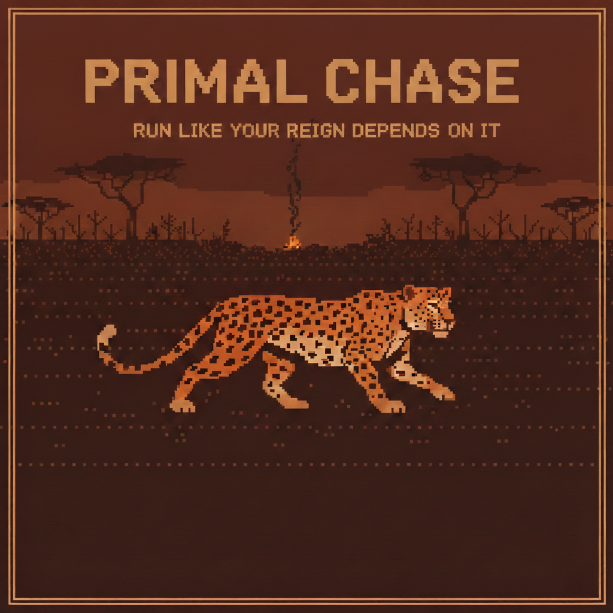

<p align="center">
  
</p>

<p align="center">
  <em>A 3D survival chase across an endless savannah.</em><br>
  <strong><a href="https://primalchase.com">Play now at primalchase.com</a></strong>
</p>

---

You are an apex predator — a king of the savannah. Behind you, persistence hunters who do not tire, do not stop, and do not forget. The chase has begun.

Every phase you choose **where to go**. One hex is a trot. Two is a push — twice the ground, far more of your body spent. Stay put and you can rest, drink, or hunt, while they close. The land is the whole decision: sand and clay hold your prints like a confession, bare rock and running water hold nothing at all. Cross ground that keeps your secret and the pursuit can break entirely — but each time they find your trail again, they come back faster.

The game is unwinnable. The only question is how long you last.

---

**Two versions, one game.**

| | |
|---|---|
| **`/`** | The 3D map game. Requires WebGL2. |
| **`/classic/`** | The original text version, V1.9. Plays in anything, and is linked automatically if WebGL is unavailable. |

Both share the same content: the same 32 terrains, 52 opportunities, 22 pressures, 40 signature encounters, 387 monologue fragments, achievements, scoring and share cards.

**No frameworks. No build step.** Vanilla HTML, CSS and JavaScript, with `three.js` vendored into `js/vendor/` so there is nothing to install and nothing fetched at runtime.

---

### Running it locally

Any static file server will do — the game needs one only because ES modules
will not load over `file://`.

```sh
python -m http.server 8777        # then open http://127.0.0.1:8777
```

Balance is simulation-tuned; the percentile tables in `js/score.js` are
regenerated from those runs, and each build carries its own table because the
two versions do not play the same. Simulation and playtest harnesses live in
`test/`, which is not published (see `.gitignore`).

---

Made by [Ryan Little](https://ryan-little.com).
